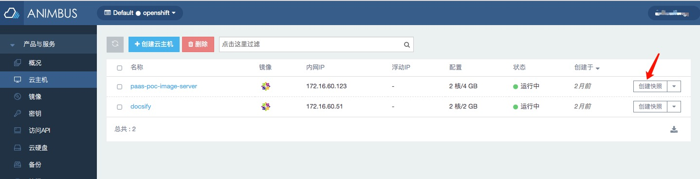
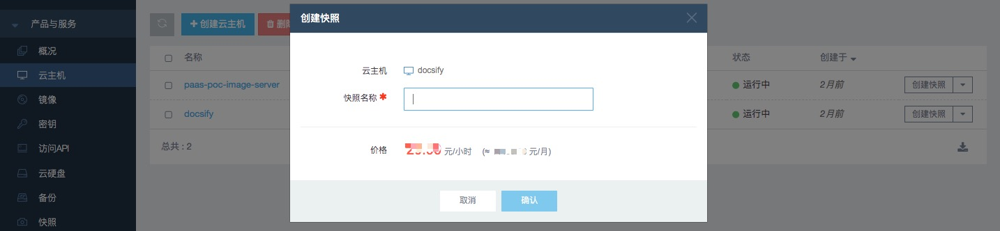
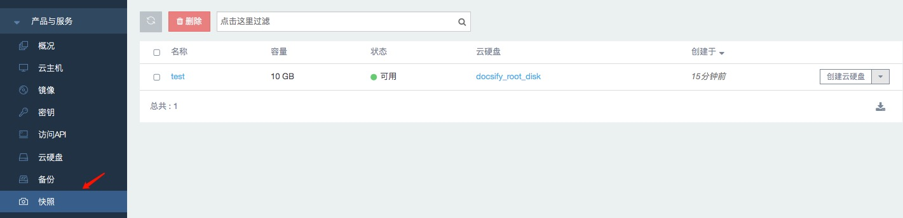
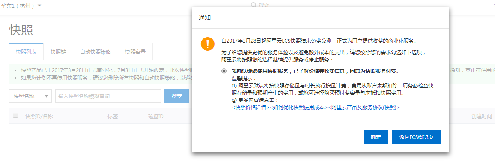
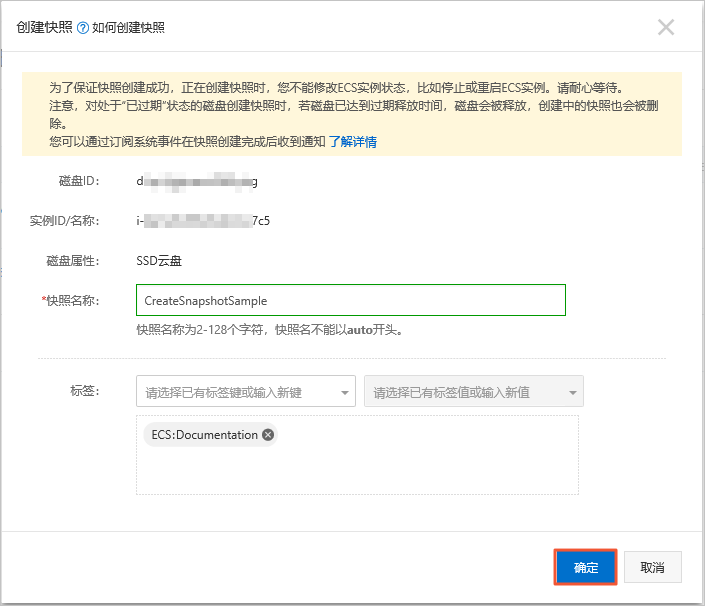
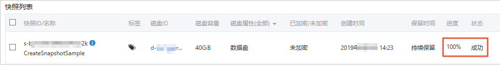
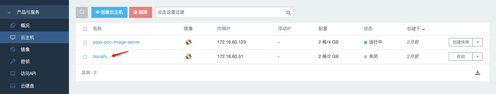
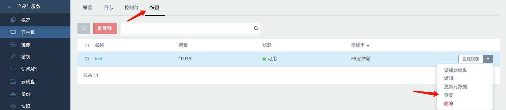
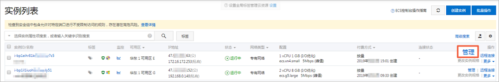

# (一) ETCD备份和恢复

## 1.1 ETCD 的备份

### 1.1.1 备份 ETCD 配置文件

> ETCD 的配置文件在 `/etc/etcd` 目录中, 其中包括 `etcd.conf` 配置文件以及集群通信所需要的证书（这些文件都是在用 ansible 安装过程中生成的）

对每个 etcd 节点备份相关配置文件:

    $ ssh master-0
    $ mkdir -p /backup/etcd-config-$(date +%Y%m%d)/
    $ cp -R /etc/etcd/ /backup/etcd-config-$(date +%Y%m%d)/

### 1.1.2 备份 ETCD 数据

> CaaS 平台为了方便调用 `etcdctl` 命令的不同版本，创建了两个别名，`etcdctl2` 和 `etcdctl3`，但是 `etcdctl3` 不会像 `etcdctl` 命令提供完整的端点列表， 因此必须指定 `--endpoints` 选项并列出所有端点

1. 备份前的准备工作
    - `etcdctl` 可执行文件必须可用，etcd 的容器必须可用
    - 确保 CaaS 平台的 apiserver 服务正常运行
    - 确保与 ETCD 集群的 `2379` 端口 TCP 通信正常
    - 确保有 ETCD 集群的请求证书
1. 检查 ETCD 的集群状态，可以使用 `etcdctl2` 或者 `etcdctl3`
    - 使用 etcd v2 api

            $ etcdctl2 --cert-file=/etc/etcd/peer.crt \
            --key-file=/etc/etcd/peer.key \
            --ca-file=/etc/etcd/ca.crt \
            --endpoints="https://master-0.example.com:2379,\
            https://master-1.example.com:2379,\
            https://master-2.example.com:2379"\
            cluster-health
    - 使用 etcd v3 api

            $ etcdctl3 --cert="/etc/etcd/peer.crt" \
            --key=/etc/etcd/peer.key \
            --cacert="/etc/etcd/ca.crt" \
            --endpoints="https://master-0.example.com:2379,\
            https://master-1.example.com:2379,\
            https://master-2.example.com:2379"
            endpoint health
1. 查看 member 列表
    - 使用 `etcd v2 api`

            $ etcdctl2 member list
    - 使用 `etcd v3 api`

            $ etcdctl3 member list
3. 开始备份 ETCD 数据

    > v2 版本有 `etcdctl backup` 命令，用这个命令可以对etcd 集群数据做备份。v3 版本有 `etcdctl snapshot save` 命令或者直接复制 `member/snap/db` 文件。`etcdctl backup` 命令会重写备份中包含的一些元数据，特别是 `节点ID` 和 `集群ID`，这意味着在备份中，节点将丢失其以前的标识。 要从备份重新创建群集，需要创建新的单节点群集，然后将其余节点添加到群集。重写元数据以防止新节点加入现有集群

    - 如果是在独立主机上运行 etcd 并使用 `v2 API`的情况，请执行以下操作
        1. 停止 etcd 服务

                $ mkdir -p /etc/origin/node/pods-stopped
                $ mv /etc/origin/node/pods/* /etc/origin/node/pods-stopped/
        1. 创建 etcd 数据备份文件夹，复制 `etcd db` 文件

                $ mkdir -p /backup/etcd-$(date +%Y%m%d)
                $ etcdctl2 backup \
                  --data-dir /var/lib/etcd \
                  --backup-dir /backup/etcd-$(date +%Y%m%d)
                $ cp /var/lib/etcd/member/snap/db /backup/etcd-$(date +%Y%m%d)
        1. 重启节点恢复 etcd 服务

                $ reboot
    - 如果是在独立主机上运行 etcd 并使用 `v3 API`的情况，请执行以下操作：
        1. 在 etcd 节点上创建快照 snapshot

                $ systemctl show etcd --property=ActiveState,SubState
                $ mkdir -p /backup/etcd-$(date +%Y%m%d)
                $ etcdctl3 snapshot save /backup/etcd-$(date +%Y%m%d)/db
        1. 通过删除 `etcd pod yaml` 文件，停止 etcd 服务

                $ mkdir -p /etc/origin/node/pods-stopped
                $  mv /etc/origin/node/pods/* /etc/origin/node/pods-stopped/
        1. 创建 etcd 数据备份文件夹，复制 `etcd db` 文件

                $ etcdctl2 backup \
                --data-dir /var/lib/etcd \
                --backup-dir /backup/etcd-$(date +%Y%m%d)
        1. 重启节点恢复 `etcd` 服务

                $ reboot
    - 如果部署 etcd 是使用 `static pod` 的方式运行的，使用 `etcd v3 api`
        1. 从 `etcd pod` 的配置文件中获取 `etcd endpoint IP`

                $ export ETCD_POD_MANIFEST="/etc/origin/node/pods/etcd.yaml"
                $ export ETCD_EP=$(grep https ${ETCD_POD_MANIFEST} | cut -d '/' -f3)
        1. 获得 `etcd pod` 名

                $ oc login -u system:admin
                $ export ETCD_POD=$(oc get pods -n kube-system | grep -o -m 1 '\S*etcd\S*')
        1. 创建快照 `snapshot`，并将它保存到本地

                $ oc project kube-system
                $ oc exec ${ETCD_POD} -c etcd -- /bin/bash -c "ETCDCTL_API=3 etcdctl \
                --cert /etc/etcd/peer.crt \
                --key /etc/etcd/peer.key \
                --cacert /etc/etcd/ca.crt \
                --endpoints $ETCD_EP \
                snapshot save /var/lib/etcd/snapshot.db"

## 1.2 ETCD 集群的恢复

- 恢复 etcd v2 & v3 数据
    1. 通过删除 etcd pod 定义文件并重新启动主机来停止所有 etcd 服务

            $ mkdir -p /etc/origin/node/pods-stopped
            $ mv /etc/origin/node/pods/* /etc/origin/node/pods-stopped/
            $ reboot
    1. 为了确保恢复正确的备份，请删除 etcd 目录
        - 要在删除目录之前备份当前的etcd数据，请运行以下命令

                $ mv /var/lib/etcd /var/lib/etcd.old
                $ mkdir /var/lib/etcd
                $ restorecon -Rv /var/lib/etcd/
        - 或者请运行以下命令删除目录和 etcd 数据

                $ rm -Rf /var/lib/etcd/*
    1. 将健康的备份数据文件还原到每个 etcd 节点。在所有 etcd 主机上执行此步骤，包括带有 etcd 的 master 节点

            $ cp -R /backup/etcd-xxx/* /var/lib/etcd/
            $ mv /var/lib/etcd/db /var/lib/etcd/member/snap/db
            $ chcon -R --reference /backup/etcd-xxx/* /var/lib/etcd/
    1. 在每个主机上运行 etcd 服务，强制新的集群。（这将为 etcd 服务创建一个自定义文件，该文件将覆盖添加 --force-new-cluster 选项的执行命令）

            $ mkdir -p /etc/systemd/system/etcd.service.d/
            $ echo "[Service]" > /etc/systemd/system/etcd.service.d/temp.conf
            $ echo "ExecStart=" >> /etc/systemd/system/etcd.service.d/temp.conf
            $ sed -n '/ExecStart/s/"$/ --force-new-cluster"/p' \
                /usr/lib/systemd/system/etcd.service \
                >> /etc/systemd/system/etcd.service.d/temp.conf

            $ systemctl daemon-reload
            $ master-restart etcd
    1. 检查错误信息

            $ master-logs etcd etcd
    1. 对每个要添加的etcd节点重复上述步骤。
    1. 检查 etcd 的健康状态

            $ etcdctl2 cluster-health
    1. 以集群模式重启 etcd 服务

            $ rm -f /etc/systemd/system/etcd.service.d/temp.conf
            $ systemctl daemon-reload
            $ master-restart etcd
    1. 检查健康状态和成员列表

            $ etcdctl2 cluster-health
            $ etcdctl2 member list
    1. 第一个实例运行后，您可以还原其余的 etcd 服务器。
    1. 修复 `PEERURLS` 参数

        恢复数据并创建新群集后，`peerURLs` 参数显示 `localhost` 而不是 etcd 正在侦听对等通信的 IP

            $ etcdctl2 member list
            5ee217d17301: name=master-0.example.com peerURLs=http://*localhost*:2380 clientURLs=https://192.168.55.8:2379 isLeader=true

        1. 获取成员 ID

                $ etcdctl member list
        1. 获取etcd侦听对等通信的IP

                $ ss -l4n | grep 2380
        1. 使用该IP更新成员信息

                $ etcdctl2 member update 5ee217d17301 https://192.168.55.8:2380
        1. 请检查 IP 是否在成员列表中

                $ etcdctl2 member list
- 恢复 etcd v3 数据

    > v3数据的还原过程类似于v2数据的还原过程。可以在恢复时选择性地验证快照完整性。如果快照是通过 `etcdctl snapshot save` 命令备份的，可以通过 `etcdctl snapshot restore` 提供一个完整性哈希的检查。如果快照是从数据目录直接复制的，则没有完整性哈希，它只能通过使用 `--skip-hash-check` 命令恢复

    1. 通过删除 `etcd pod` 的定义并重新启动主机来停止所有 etcd 服务

            $ mkdir -p /etc/origin/node/pods-stopped
            $ mv /etc/origin/node/pods/* /etc/origin/node/pods-stopped/
            $ reboot
    1. 清除所有旧数据，因为 `etcdctl` 要在将要在执行还原过程的节点中重新创建它

            $ rm -Rf /var/lib/etcd
    1. 运行 `snapshot restore` 命令，使用`/etc/etcd/etcd.conf` 文件中的值替换变量，例如:

            $ etcdctl3 snapshot restore /backup/etcd-xxxxxx/backup.db \
            --data-dir /var/lib/etcd \
            --name master-0.example.com \
            --initial-cluster "master-0.example.com=https://192.168.55.8:2380" \
            --initial-cluster-token "etcd-cluster-1" \
            --initial-advertise-peer-urls https://192.168.55.8:2380 \
            --skip-hash-check=true
    1. selinux 规则配置

            $ restorecon -Rv /var/lib/etcd
    1. 启动 etcd 服务

            $ systemctl start etcd
    1. 检查错误信息

            $  master-logs etcd etcd
    1. 对每个要恢复的 etcd 节点重复上述步骤
- 如果部署 `etcd` 是使用 `static pod` 的方式运行的，请遵循下列步骤恢复集群
    1. 停止 `etcd pod`

            $ mv /etc/origin/node/pods/etcd.yaml .
    1. 清除之前的 `etcd` 数据

            $ rm -rf /var/lib/etcd
    1. 使用 `snapshot` 恢复集群数据

            $ etcdctl3 snapshot restore /var/lib/etcd/snapshot.db
                --data-dir /var/lib/etcd/
                --name [ETCD_NAME]
                --initial-cluster "[ETCD_INITIAL_CLUSTER]=https://[ETCD_HOST_IP]:2380"
                --initial-cluster-token "[ETCD_INITIAL_CLUSTER_TOKEN]"
                --initial-advertise-peer-urls https://[ETCD_HOST_IP]:2380
                --skip-hash-check=true
        **从 `/backup/etcd-config-[备份日期]/etcd.conf` 文件中获得相关的参数**
    1. 给相关文件及目录设置相关的 `selinux` 权限

            $ chown -R etcd.etcd /var/lib/etcd/
            $ restorecon -Rv /var/lib/etcd/
    1. 重启 `etcd` 服务

            $ mv etcd.yaml /etc/origin/node/pods/.

# (二) 虚拟机快照的备份和恢复

## 2.1 虚拟机快照的备份

- 如果是在 Animbus 的环境上，请按照如下方式进行备份
    1. 登录 Animbus 平台，选择`产品与服务` -> `云主机`
    1. 单击 `创建快照` 按钮

         
    1. 输入 `快照名称`，单击 `确定`

         
    1. 查看创建的快照

        
- 如果是在阿里云的环境上，请按照如下方式进行快照[备份](https://help.aliyun.com/document_detail/108381.html)
    1. 开通快照(在初次使用阿里云快照前，需要确认开通快照服务)
        1. 登录[ECS管理控制台](https://ecs.console.aliyun.com/)
        1. 在左侧导航栏，选择存储与快照 > 快照。
        1. 在弹出的通知中，阅读开通声明，单击确定开通快照

            

        > 开通快照后，阿里云默认将按快照容量与时长执行按量计费。费用从您的账户余额扣除，请务必检查快照容量和预期产生的费用。您也可选择购买预付费容量包抵扣快照费用
    1. 创建快照

        > 快照可以保留某一时间点的云盘数据状态，常用于数据备份和制作自定义镜像

        创建快照时，资源的状态要求如下：
        * 实例必须处于运行中或已停止状态
        * 云盘必须处于使用中或已过期状态

        **说明: 若创建快照时已过期状态的云盘正好达到过期释放时间，云盘被释放的同时也会删除创建中（Creating）的快照。**

        1. 登录[ECS管理控制台](https://ecs.console.aliyun.com/)
        1. 在左侧导航栏，单击实例与镜像 > 实例
        1. 在顶部状态栏处，选择地域
        1. 找到需要创建快照的实例，在操作列中，单击管理

            
        1. 在左侧导航栏，单击本实例磁盘，然后单击对应云盘右侧的创建快照。一次只能选择一块云盘，磁盘属性可以是系统盘和数据盘

            
        1. 输入快照的名称，单击确定

            
        1. 在左侧导航栏单击本实例快照查看快照任务。您可以看到快照进度和快照状态

        **您也可以通过存储与快照 > 云盘页面的操作路径完成创建快照**

## 2.2 虚拟机快照的恢复

- 如果是在 Animbus 的环境上，请按照如下方式进行快照恢复
    1. 前提条件
        - 您已经为云硬盘创建快照，而且要回滚的云硬盘当前没有正在创建的快照
        - 云硬盘未被释放
        - 云硬盘必须已经挂载到某台实例上，而且已经停止实例
    1. 操作步骤
        1. 登录 Animbus
        1. 选择`产品与服务` -> `云主机`，单击 `实例名称`，进入实例详情页

            
        1. 选择 `快照选项卡`，找到要恢复的快照，然后单击右侧的下拉列表，选择 `恢复`

            
        1. 单击 `确定`，使用该快照恢复云主机

            
- 如果是在阿里云的环境上，请按照如下方式进行快照[恢复](https://help.aliyun.com/document_detail/25456.html?spm=a2c4g.11186623.6.795.6db76c73n0gTbB)
    > 回滚磁盘常应用于系统故障、错误操作和应用版本回退等场景。回滚时，磁盘必须拥有至少一份历史快照。回滚系统盘后，默认自动绑定实例当前的密钥对或密码

    1. 前提条件
        - 您已经为云盘创建快照，而且要回滚的云盘当前没有正在创建的快照
        - 云盘未被释放
        - 更换系统盘后，历史系统盘快照不能用于回滚新的系统盘
        - 云盘被用作创建动态扩展卷或者RAID阵列时，您必须预先停止所有I/O操作，再使用快照回滚云盘
        - 云盘必须已经挂载到某台ECS实例上，而且已经停止实例
    1. 操作步骤

        > 单次只能回滚一块磁盘，实例上挂载的其他磁盘不受影响。回滚后，整块磁盘会恢复到某个时间点的状态，而不是某个分区或目录当时的状态。如果您选择回滚后立即启动实例，云盘回滚成功后，实例会自动启动

        1. 登录[ECS管理控制台](https://ecs.console.aliyun.com/)
        1. 在左侧导航栏，选择实例与镜像 > 实例
        1. 在顶部状态栏处，选择地域
        1. 找到需要回滚云盘的实例，在操作列中，单击管理

            
        1. 在左侧导航栏中，单击本实例快照
        1. 选择需要的快照，在操作列中，单击回滚磁盘
        1. 在弹出的对话框中，单击确定
    1. 后续步骤

        > 如果在数据盘创建快照后，您做过扩容操作，回滚云盘后，您需要登录实例重新扩容文件系统。具体操作，请参见:

        - [扩容数据盘_Linux](https://help.aliyun.com/document_detail/25452.html?spm=a2c4g.11186623.2.19.37254d44TG8dO6#concept-z11-xsh-ydb)
        - [扩容数据盘_Windows](https://help.aliyun.com/document_detail/25451.html?spm=a2c4g.11186623.2.20.37254d44TG8dO6#concept-rjc-l5h-ydb)

        > 回滚云盘后，如果您需要同步数据，请按以下步骤操作。假设您已经在时间点一为原云盘创建了快照

        1. 在时间点二，为原云盘创建快照B。具体操作，请参见[创建快照](https://help.aliyun.com/document_detail/25455.html?spm=a2c4g.11186623.2.21.37254d44TG8dO6#concept-eps-gbl-xdb)
        1. 使用快照A回滚原云盘
        1. 使用快照B创建新云盘
        1. 在同一实例上挂载新云盘。具体操作，请参见[挂载云盘](https://help.aliyun.com/document_detail/25446.html?spm=a2c4g.11186623.2.22.37254d44TG8dO6#concept-llz-b4c-ydb)
        1. 远程连接实例
        1. (可选) 如果是Linux实例，运行mount命令挂载新云盘的分区
        1. 将新云盘中的有用数据复制到原云盘中
        1. 可选）按需释放新云盘

# (三) CaaS 集群节点的添加、移除和迁移

## 3.1 集群节点的添加

> 您可以通过运行 scaleup.yml playbook 将新节点添加到群集。此 playbook 查询 master，为新节点生成和分发新证书，然后仅在新主机上运行配置 playbooks。在运行 scaleup.yml playbook 之前，请完成所有必备[主机准备步骤](https://docs.okd.io/latest/install/host_preparation.html#preparing-for-advanced-installations-origin)

### 3.1.1 添加 nodes 和 masters 节点
1. 编辑 inverntory file，在 `[OSEv3:children]` 部分添加 `new_<host_type>`，例如添加一个新的 node 节点（如果添加 master 节点，则添加 `new_masters`）：

        [OSEv3:children]
        masters
        nodes
        new_nodes
1. 创建 `[new_<host_type>]` 部分以指定新主机的节点信息。将此部分格式化为现有部分，如以下添加新节点的示例所示:

        [nodes]
        master[1:3].example.com
        node1.example.com openshift_node_group_name='node-config-compute'
        node2.example.com openshift_node_group_name='node-config-compute'
        infra-node1.example.com openshift_node_group_name='node-config-infra'
        infra-node2.example.com openshift_node_group_name='node-config-infra'

        [new_nodes]
        node3.example.com openshift_node_group_name='node-config-infra'

    更多配置信息可查看 [Configuring Host Variables](https://docs.okd.io/latest/install/configuring_inventory_file.html#advanced-host-variables)

    **注意: 当添加一个新的 master 节点时，将节点添加到 `[new_masters]` 部分和 `[new_nodes]` 两个部分下，以确保新 master 节点成为 OpenShift SDN 的一部分**
1. 运行 `scaleup.yml playbook`
    - 对于 nodes 节点

            $ ansible-playbook [-i /path/to/file] playbooks/openshift-node/scaleup.yml
    - 对于 masters 节点

            $ ansible-playbook [-i /path/to/file] playbooks/openshift-master/scaleup.yml
1. 在运行完 playbooks 之后，验证安装

        $ oc get nodes
1. 如果集群中已经部署了 EFK，请设置 node 标签为 `logging-infra-fluentd=true`

        $ oc label node/new-node.example.com logging-infra-fluentd=true
1. 将您在 `[new_<host_type>]` 部分中定义的节点移动到相应的部分。通过移动这些节点，让使用此 `inventory file` 的后续 playbook 正确的配置节点。您可以保留 `[new_<host_type>]` 部分为空。例如，添加新节点时：

        [nodes]
        master[1:3].example.com
        node1.example.com openshift_node_group_name='node-config-compute'
        node2.example.com openshift_node_group_name='node-config-compute'
        node3.example.com openshift_node_group_name='node-config-compute'
        infra-node1.example.com openshift_node_group_name='node-config-infra'
        infra-node2.example.com openshift_node_group_name='node-config-infra'

        [new_nodes]

### 3.1.2 添加 ETCD 节点

1. 编辑 inventory file，将 `new_<host_type>` 添加到 `[OSEv3:children]` 组，并在 `new_<host_type>` 组下添加节点，例如添加一个新的 etcd 节点:

        [OSEv3:children]
        masters
        nodes
        etcd
        new_etcd

        [etcd]
        etcd1.example.com
        etcd2.example.com

        [new_etcd]
        etcd3.example.com
1. 运行 `etcd scaleup.yml playbook`

        ansible-playbook [-i /path/to/file] playbooks/openshift-etcd/scaleup.yml
1. 在 playbook 运行成功之后，验证安装结果

        $ oc get nodes

## 3.2 节点的删除

> 使用 `CLI` 删除节点时，将在 `Kubernetes` 中删除节点对象，但不会删除节点本身上存在的pod。OKD无法访问任何未由 replication controller 支持的 bare pod，由 replication controller 支持的 pod 将被重新安排到其他可用节点，并且 需要手动删除本地的 `manifest pods`

1. [撤出当前节点上的 pod，使之调度到其它节点](https://docs.okd.io/latest/admin_guide/manage_nodes.html#evacuating-pods-on-nodes)
1. 删除 `node object`，例如:

        $ oc delete node <node>
1. 验证 node 是否从节点列表中移除

        $ oc get nodes

    pod 现在应该被调度到其它状态为 `Ready` 的节点
1. 卸载节点
    1. 创建仅引用删除的主机的 inventory file。例如，要仅从一个节点删除内容

            [OSEv3:children]
            nodes

            [OSEv3:vars]
            ansible_ssh_user=root
            openshift_deployment_type=origin

            [nodes]
            node3.example.com openshift_node_group_name='node-config-infra'
    1. 运行 `uninstall.yml` playbook

            ansible-playbook -i /path/to/new/file ~/openshift-ansible/playbooks/adhoc/uninstall.yml

## 3.3 节点的迁移

> 您可以单独或成组（2个，5个，10个等）迁移节点，具体取决于您是否熟悉节点上的服务的运行和扩展方式

1. 对于迁移节点，请在新的数据中心为节点提供新的虚拟机
1. 要添加新节点(参考3.1节)，需要扩展基础架构。确保正确设置新节点的标签，并将新的 API server 添加到负载均衡器并成功提供流量
1. 评估并缩小规模
    1. 标记当前节点（在老数据中心的）`unscheduled`

             oc adm manage-node <node1> <node2> --schedulable=false
    1. [撤出当前节点上的 pod，使之调度到其它节点](https://docs.okd.io/latest/admin_guide/manage_nodes.html#evacuating-pods-on-nodes)
    1. 验证撤出的服务是否在新节点上运行
1. 移除 node
    1. 验证节点是否仍有正在运行的进程
    1. 停止服务或删除节点

# (四) 系统组件的镜像升级

## 4.1 同步镜像（local registry 部署方式）

> 默认在部署 local registry 的节点执行此操作

1. 拉取最新的镜像

        docker pull docker.io/99cloud/[组件镜像]:[version]
1. 给镜像打上新的标签( version 与 old version 保持一致，方便替换)

        docker tag docker.io/99cloud/[组件镜像]:[tag] [local_registry_url]/99cloud/[组件镜像]:[version]
1. push 新的镜像到 local registry

        docker push [local_registry_url]/99cloud/[组件镜像]:[version]

## 4.2 节点镜像更新

1. 更新节点上的镜像(注意：需要逐台更新)

        docker pull [local_registry_url] /99cloud/[组件镜像]:[version]
1. 检查组件镜像是否更新

        docker ps | grep [new_image_id]
1. 当前节点组件镜像更新成功以后，逐台更新部署该组件的节点

# (五) 监控/日志信息的数据备份和扩容

> 监控与日志在安装时指定数据使用持久化存储

## 5.1 数据备份

> 您可以将持久数据从容器内部同步到服务器，有关特定应用程序的正确备份过程，请参阅相关产品文档。例如，复制 mysql 数据目录本身不会创建可用的备份。而是运行关联应用程序的特定备份过程，然后同步相关数据。

1. 查看运行中的监控或日志中使用了持久化后端存储的 pod，这里以日志来举例:

        $ oc describe po logging-es-data-master-xxxx -n openshift-logging
            ...
             Mounts:
              /elasticsearch/persistent from elasticsearch-storage (rw)
              /etc/elasticsearch/secret from elasticsearch (ro)
              /etc/podinfo from podinfo (ro)
              /usr/share/java/elasticsearch/config from elasticsearch-config (ro)
              /var/run/secrets/kubernetes.io/serviceaccount from aggregated-logging-elasticsearch-token-wwqpt (ro)
            ...
            Volumes:
              proxy-tls:
                Type:        Secret (a volume populated by a Secret)
                SecretName:  prometheus-tls
                Optional:    false
              elasticsearch:
                Type:        Secret (a volume populated by a Secret)
                SecretName:  logging-elasticsearch
                Optional:    false
              elasticsearch-config:
                Type:      ConfigMap (a volume populated by a ConfigMap)
                Name:      logging-elasticsearch
                Optional:  false
              podinfo:
                Type:  DownwardAPI (a volume populated by information about the pod)
                Items:
                  limits.memory -> mem_limit
              elasticsearch-storage:
                Type:       PersistentVolumeClaim (a reference to a PersistentVolumeClaim in the same namespace)
                ClaimName:  logging-es-0
                ReadOnly:   false
              aggregated-logging-elasticsearch-token-wwqpt:
                Type:        Secret (a volume populated by a Secret)
                SecretName:  aggregated-logging-elasticsearch-token-wwqpt
                Optional:    false
            ...
    此时会看到持久数据位于 `/elasticsearch/persistent` 目录
1. 复制数据到本地进行备份(时间较长，耐心等待)

        oc rsync logging-es-data-master-xxxx:/elasticsearch/persistent .

## 5.2 扩容

> 基于需要调整文件系统大小的卷类型（例如 GCE PD，EBS 和 Cinder ）扩展 PVC 的过程分为两步。此过程通常涉及在 CloudProvider 中扩展卷对象，然后在实际节点上扩展文件系统。只有在使用卷启动新pod时，才会在节点上扩展文件系统。

- 以下过程假定 PVC 先前是从 StorageClass 创建的，并且 StorageClass 的 allowVolumeExpansion 设置为 true，然后更新监控/日志信息所使用的 pvc：
    1. 编辑 PVC 并通过编辑 `spec.resources.requests` 请求新大小。 `CloudProvider` 对象完成大小调整后，PVC 将设置为 `FileSystemResizePending`
    1. 输入以下命令进行检查

            oc describe pvc <pvc_name>

    当 CloudProvider 对象完成大小调整后，持久卷（ PV ）对象将响应`PersistentVolume.Spec.Capacity` 中新请求的大小。此时，您可以从 PVC 创建或重新创建新 pod，以完成文件系统大小调整。当 pod 运行时，新请求 pvc 的大小可用，并且从 PVC 中删除`FileSystemResizePending`